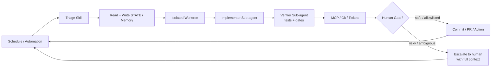

# Looping


<p align="center">
  <a href="https://cobusgreyling.github.io/looping/">
    
  </a>
</p>

<p align="center">
  <a href="https://github.com/eli-labz/looping/stargazers"></a>
  <a href="https://github.com/eli-labz/looping/actions/workflows/audit.yml"></a>
  <a href="https://www.npmjs.com/package/@cobusgreyling/loop-audit"></a>
  <a href="https://www.npmjs.com/package/@cobusgreyling/loop-init"></a>
  <a href="https://www.npmjs.com/package/@cobusgreyling/loop-cost"></a>
  <a href="https://www.npmjs.com/package/@cobusgreyling/loop-sync"></a>
  <a href="https://github.com/eli-labz/looping/blob/main/LICENSE"></a>
  <a href="https://cobusgreyling.github.io/looping/"></a>
</p>


<p align="center">
  <a href="https://cobusgreyling.github.io/looping/">
    
  </a>
</p>

> **Stop prompting. Design the loop. Get a score.**

Project owner: Darrell Mesa (darrell.mesa@pm-ss.org) · https://eli-labz.com/

---

<p align="center">
  <strong>⭐ If Looping saves you time, a star helps others find it</strong><br/>
  <a href="https://github.com/eli-labz/looping/stargazers">
    
  </a>
  &nbsp;
  <a href="https://github.com/eli-labz/looping/fork">
    
  </a>
</p>

---

<p align="center">
  
</p>

```bash
npx @cobusgreyling/loop-init .
```

`loop-init` scaffolds skills, state, and budget files, then prints your **Loop Ready** score and first loop command. Swap `--tool` for `claude`, `codex`, or `opencode`.

<p align="center">
  <a href="docs/QUICKSTART.md">
    
  </a>
</p>

Looping replaces you as the person who prompts the agent — you design the system that does it instead.

**New here?** [Quickstart (5 min)](docs/QUICKSTART.md) · [Interactive picker](https://cobusgreyling.github.io/looping/#interactive)

For developers using Grok, Claude Code, Codex, Cursor, and other AI coding agents.

<p align="center">
  <strong><a href="https://cobusgreyling.github.io/looping/">→ Interactive showcase + pattern picker</a></strong>
  ·
  <a href="https://cobusgreyling.substack.com/p/looping">Essay</a>
  ·
  <a href="https://addyosmani.com/blog/looping/">Addy Osmani</a>
</p>

## 🆕 What's New — v1.5.0

| Feature | What it does |
|---------|-------------|
| **loop-sync v1.0.0** | Detects drift between `STATE.md` and `LOOP.md` — catches loops that wander off design |
| **Constraints scoring** | `loop-audit` now scores budget caps, denylist completeness, and human-gate coverage |
| **MCP server (v1)** | Runtime lookup for patterns, skills, and state over MCP |
| **Task Families** | New `text-tasks/` and `human-action-tasks/` templates for staged rollout |
| **Physical-World Boundaries** | Supervisor-friendly rollout guide for loops that touch the physical world |

---

## Contents

- [Quickstart (5 min)](docs/QUICKSTART.md)
- [Quick Links](#quick-links)
- [Why This Matters](#why-this-matters)
- [The Five Building Blocks + Memory](#the-five-building-blocks--memory)
- [Patterns](#patterns)
- [Task Families](#task-families)
- [Getting Started (5 minutes)](#getting-started-5-minutes)
- [Examples by Tool](#examples-by-tool)
- [Operating & Safety](#operating--safety)
- [Caveats](#caveats)
- [Contributing](#contributing)
- [Sources](#sources)
- [License](#license)

## Quick Links

| Start here | Description |
|------------|-------------|
| [Quickstart (5 min)](docs/QUICKSTART.md) | Scaffold → cost check → audit → first loop — **start here if you just landed** |
| [Looping essay](https://cobusgreyling.substack.com/p/looping) | The concept, primitives, and Grok mapping — read for the why |
| [Pattern Picker](docs/pattern-picker.md) | Which loop to run first — **start here if unsure** |
| [Primitives Matrix](docs/primitives-matrix.md) | Cross-tool loop primitive mapping — bookmark this |
| [Loop Design Checklist](docs/loop-design-checklist.md) | Ship readiness rubric |
| [Patterns](patterns/README.md) | 7 production patterns + [interactive picker](https://cobusgreyling.github.io/looping/#interactive) |
| [Task Families (text + human-action)](patterns/text-tasks/) | New task-family templates for text tasks and supervised human-action workflows |
| [Token Schemas](schemas/) | Observation/action/outcome/state schemas for auditable loop runtime |
| [Core Loop Runtime](docs/core-loop-runtime.md) | Observe → plan → risk-gate → execute → verify → trace → recover/escalate |
| [Starters](starters/) | Clone-and-run kits (Grok, Claude Code, Codex, Opencode) |
| [Opencode examples](examples/opencode/) | CLI-first loops: cron/systemd + `opencode run`, skills, worktrees |
| [loop-audit](tools/loop-audit/) | Loop Readiness Score CLI (v1.5 + constraints scoring) — `npx @cobusgreyling/loop-audit . --suggest` · `--badge` for README |
| [loop-init](tools/loop-init/) | Scaffold starters + budget/run-log + constraints (v1.2) — `npx @cobusgreyling/loop-init . --pattern daily-triage --tool grok` |
| [loop-cost](tools/loop-cost/) | Token spend estimator — `npx @cobusgreyling/loop-cost` |
| [loop-sync](tools/loop-sync/) | Drift detection between `STATE.md` and `LOOP.md` — `npx @cobusgreyling/loop-sync .` |
| [loop-mcp-server](tools/mcp-server/) | MCP runtime lookup for patterns, skills, state — `node tools/mcp-server/dist/index.js` (repo v1; npm pending) |
| [Goal Engineering](https://github.com/cobusgreyling/goal-engineering) | **Companion:** loops discover, goals finish — `/goal` + [stack cookbook](https://github.com/cobusgreyling/goal-engineering/blob/main/docs/stack-cookbook.md) (`npx @cobusgreyling/goal doctor .`) |
| [Stories](stories/) | Real wins and honest failures |
| [Community update](https://github.com/eli-labz/looping/discussions) | v1.5.0 release — loop-sync, constraints, MCP server |
| [Add your project](https://github.com/eli-labz/looping/discussions) | **Pinned:** Loop Ready badge + adopters list |

<p align="center">
  
</p>

## Why This Matters

Peter Steinberger:
> “You shouldn’t be prompting coding agents anymore. You should be designing loops that prompt your agents.”

Boris Cherny (Head of Claude Code at Anthropic):
> “I don’t prompt Claude anymore. I have loops running that prompt Claude and figuring out what to do. My job is to write loops.”

The leverage point has moved from crafting individual prompts to designing the control systems that orchestrate agents over time.

## The Five Building Blocks + Memory

| Primitive | Job in the Loop |
|-----------|-----------------|
| **Automations / Scheduling** | Discovery + triage on a cadence |
| **Worktrees** | Safe parallel execution |
| **Skills** | Persistent project knowledge |
| **Plugins & Connectors** | Reach into your real tools (MCP) |
| **Sub-agents** | Maker / checker split |
| **+ Memory / State** | Durable spine outside any conversation |

Full detail: [docs/primitives.md](docs/primitives.md) · Cross-tool matrix: [docs/primitives-matrix.md](docs/primitives-matrix.md)

### Visual Overview

<p align="center">
  
</p>

### Anatomy of a Loop

<p align="center">
  
</p>

<details>
<summary>Mermaid diagram (copy-friendly)</summary>



</details>

**This reference repo now runs its own `validate-patterns` + `audit` workflows on every push/PR** (see `.github/workflows/`). We also added `LOOP.md` describing the loops that will maintain it.

## Patterns

<p align="center">
  
</p>

| Pattern | Cadence | Starter | Week 1 | Token cost |
|---------|---------|---------|--------|------------|
| [Daily Triage](patterns/daily-triage.md) | 1d–2h | [minimal-loop](starters/minimal-loop/) | **L1** report | Low |
| [PR Babysitter](patterns/pr-babysitter.md) | 5–15m | [pr-babysitter](starters/pr-babysitter/) | L1 watch | High |
| [CI Sweeper](patterns/ci-sweeper.md) | 5–15m | [ci-sweeper](starters/ci-sweeper/) | L2 cautious | Very high |
| [Dependency Sweeper](patterns/dependency-sweeper.md) | 6h–1d | [dependency-sweeper](starters/dependency-sweeper/) | L2 patch-only | Medium |
| [Changelog Drafter](patterns/changelog-drafter.md) | 1d or tag | [changelog-drafter](starters/changelog-drafter/) | **L1** draft | Low |
| [Post-Merge Cleanup](patterns/post-merge-cleanup.md) | 1d–6h | [post-merge-cleanup](starters/post-merge-cleanup/) | **L1** off-peak | Low |
| [Issue Triage](patterns/issue-triage.md) | 2h–1d | [issue-triage](starters/issue-triage/) | **L1** propose-only | Low |

Not sure which to pick? Try the [interactive picker](https://cobusgreyling.github.io/looping/#interactive) or [pattern-picker](docs/pattern-picker.md).

Machine-readable index: [patterns/registry.yaml](patterns/registry.yaml) (7 patterns)

## Task Families

New family folders for staged capability rollout:

- [Text Tasks](patterns/text-tasks/) - summarize, classify, draft, compare, extract
- [Human-Action Tasks](patterns/human-action-tasks/) - browser, spreadsheet, email, and supervised physical-world routing

Runtime token models and schemas:

- [TypeScript token model](tools/mcp-server/src/models/tokens.ts)
- [Observation token schema](schemas/observation-token.schema.json)
- [Human-action token schema](schemas/human-action-token.schema.json)
- [Outcome token schema](schemas/outcome-token.schema.json)
- [Looping agent state schema](schemas/looping-agent-state.schema.json)

## Getting Started (5 minutes)

```bash
# 1. Scaffold + get your Loop Ready score (printed automatically)
npx @cobusgreyling/loop-init . --pattern daily-triage --tool grok

# 2. Estimate token spend for your cadence
npx @cobusgreyling/loop-cost --pattern daily-triage --level L1

# 3. Re-audit after improvements
npx @cobusgreyling/loop-audit . --suggest

# Optional: paste Loop Ready badge into your README
npx @cobusgreyling/loop-audit . --badge

# 4. See scores climb: empty → L1 → L2
bash scripts/before-after-demo.sh

# 5. Start report-only (Grok example)
/loop 1d Run loop-triage. Update STATE.md. No auto-fix in week one.
```

All three CLIs publish to npm from tagged releases — see [docs/RELEASE.md](docs/RELEASE.md). No clone required.

**Develop from source** (monorepo contributors):

```bash
cd tools/loop-init && npm ci && npm test && node dist/cli.js /path/to/project --pattern daily-triage --tool grok
cd tools/loop-audit && npm ci && npm test && node dist/cli.js /path/to/project --suggest
cd tools/loop-cost && npm ci && npm test && node dist/cli.js --pattern ci-sweeper --cadence 15m
```

Phased rollout: **L1 report → L2 assisted fixes → L3 unattended** — see [loop-design-checklist](docs/loop-design-checklist.md).

## Examples by Tool

- [Grok](examples/grok/daily-triage.md)
- [Claude Code](examples/claude-code/)
- [Codex](examples/codex/)
- [OpenClaw](examples/openclaw/daily-triage.md)
- [Opencode](examples/opencode/)
- [GitHub Actions](examples/github-actions/)
- [Revenue Variance Human-Action Loop](examples/revenue-variance-human-action-loop/)

## Operating & Safety

- [Failure Modes](docs/failure-modes.md) — incident-style catalog
- [Anti-Patterns](docs/anti-patterns.md) — design mistakes before production
- [Multi-Loop Coordination](docs/multi-loop.md) — when loops collide
- [Operating Loops](docs/operating-loops.md) — cost, logging, when to kill
- [Safety](docs/safety.md) — denylist, auto-merge, MCP scopes
- [Security](SECURITY.md) — reporting and unattended automation risks
- [Concepts](docs/concepts.md) — intent debt, comprehension debt, harness vs loop
- [MCP Cookbook](examples/mcp/) — connector examples by pattern
- [Governance](docs/governance.md) — reliability metrics as product features
- [Risk Gates](docs/risk-gates.md) — allow/block/escalate policy checks
- [Human Approval](docs/human-approval.md) — explicit sign-off for high-impact actions
- [Action Ledger](docs/action-ledger.md) — auditable observation/action/outcome trace
- [Physical-World Boundaries](docs/physical-world-boundaries.md) — supervised, simulator-friendly rollout

## Caveats

Looping amplifies judgment — both good and bad.

- **Token costs** can explode with sub-agents and long-running loops.
- **Verification is still on you.** Unattended loops make unattended mistakes.
- **Comprehension debt** grows faster unless you read what the loop ships.
- Two people can run the same loop and get opposite results. The loop doesn't know. You do.

Addy Osmani:
> “Build the loop. But build it like someone who intends to stay the engineer, not just the person who presses go.”

## Contributing

Share production patterns, tool mappings, and failure stories. See [CONTRIBUTING.md](CONTRIBUTING.md), [adopters](docs/adopters.md), and [GitHub Discussions](https://github.com/eli-labz/looping/discussions).

## Sources

- [Cobus Greyling – Looping (Substack)](https://cobusgreyling.substack.com/p/looping)
- [Addy Osmani – Looping](https://addyosmani.com/blog/looping/)
- [Attribution & further reading](resources/sources.md)

## License

MIT

---

*Practical, tool-aware reference for Looping, patterns you can clone, checklists you can ship against, and stories that include what broke.*

<p align="center">
  <a href="https://cobusgreyling.substack.com/p/looping">Essay</a>
  ·
  <a href="https://cobusgreyling.github.io/looping/">Showcase</a>
  ·
  <a href="https://github.com/eli-labz">eli-labz</a>
</p>

<p align="center">
  <a href="https://www.star-history.com/#eli-labz/looping&Timeline">
    <picture>
      <source media="(prefers-color-scheme: dark)" srcset="https://api.star-history.com/svg?repos=eli-labz%2Flooping&type=Timeline&theme=dark" />
      <source media="(prefers-color-scheme: light)" srcset="https://api.star-history.com/svg?repos=eli-labz%2Flooping&type=Timeline" />
      
    </picture>
  </a>
</p>

